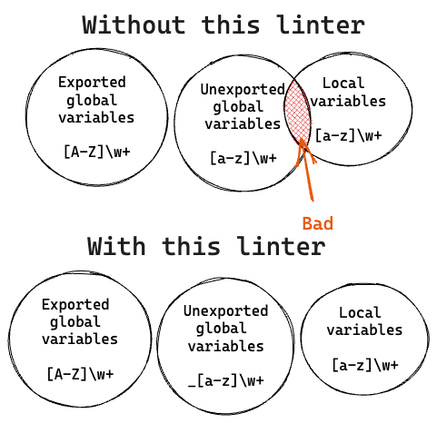

# unexportedglobal

- [Introduction](#introduction)
  - [Why](#why)
- [Usage](#usage)
  - [From the command line](#command-line-usage)
  - [As a golangci-lint plugin](#use-as-a-golangci-lint-plugin)
- [FAQ](#faq)
- [License](#license)

## Introduction

[](https://pkg.go.dev/go.abhg.dev/unexportedglobal)
[](https://github.com/abhinav/unexportedglobal/actions/workflows/ci.yml)
[](https://codecov.io/gh/abhinav/unexportedglobal)

unexportedglobal is a linter for Go that verifies
that all unexported global constants and variables in a Go program
are prefixed with an underscore (`_`).

<table>
<thead><tr><th>Bad</th><th>Good</th></tr></thead>
<tbody>
<tr><td>

```go
const defaultHost = "example.com"
```

</td><td>

```go
const _defaultHost = "example.com"
```

</td></tr>
</tbody></table>

### Why

The linter is inspired by the guidance,
[Prefix Unexported Globals with `_`](https://github.com/uber-go/guide/blob/master/style.md#prefix-unexported-globals-with-_)
in the [Uber Go Style Guide](https://github.com/uber-go/guide/blob/master/style.md).

Prefixing unexported global variables with an underscore
effectively places them in a namespace separate from normal variables,
eliminating risk of accidentally shadowing or overwriting
such a global variable.

<div align="center">



</div>

## Usage

### Command line usage

To use unexportedglobal from the command line,
first install the standalone program by running:

```bash
go install go.abhg.dev/unexportedglobal/cmd/unexportedglobal@latest
```

Then use it like so:

```bash
go vet -vettool=$(which unexportedglobal) ./...
```

You can also invoke it directly,
although the output can be noisier in this form.

```bash
unexportedglobal ./...
```

### Use as a golangci-lint plugin

To use unexportedglobal as a golangci-lint plugin,
take the following steps:

- Clone the repository or download a source archive
  from the Releases page.

  ```bash
  git clone https://github.com/abhinav/unexportedglobal.git
  ```

- Build the plugin:

  ```bash
  cd unexportedglobal
  go build -buildmode=plugin ./cmd/unexportedglobal
  ```

- Add the linter under `linter-settings.custom` in your `.golangci.yml`,
  referring to the compiled plugin (usually called 'unexportedglobal.so').

  ```yaml
  linter-settings:
    custom:
      unexportedglobal:
        path: unexportedglobal.so
        description: Verify unexported globals have an underscore prefix.
        original-url: go.abhg.dev/unexportedglobal
  ```

- Run golangci-lint as usual.

> **Warning**:
> For this to work, your plugin must be built for the same environment
> as the golangci-lint binary you're using.
>
> See [How to add a private linter to golangci-lint](https://golangci-lint.run/contributing/new-linters/#how-to-add-a-private-linter-to-golangci-lint) for details.

## FAQ

**What about unexported sentinel errors?**

This linter does not require you to rename sentinel error values.
That is, the following will be left alone:

```go
var errNotFound = errors.New("not found")
```

This aligns with the exception carved for this case in the style guide.

## License

This software is made available under the MIT License.
See LICENSE for details.
